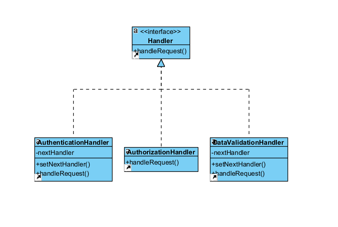

# Design pattern de manière globale :
L'objectif est de traiter des demandes successives en les faisant passer à travers une chaîne de handlers, chacun responsable d'une étape spécifique du traitement

# Avantages :
- Contrôler l’ordre des traitements de la demande
- Ajouter de nouveaux handlers dans le programme sans toucher au code client existant

# Inconvénients : 
- Il se peut que certaines demandes ne soient pas traitées
  
# Représentation UML : 


# Implémentation en PHP :
``` php
<?php

interface Handler {
    public function handleRequest($request);
}

class AuthenticationHandler implements Handler {
    private $nextHandler;

    public function setNextHandler(Handler $handler) {
        $this->nextHandler = $handler;
    }

    public function handleRequest($request) {
        if ($request['authenticated']) {
            echo "Authentification réussie.\n";
            if ($this->nextHandler !== null) {
                $this->nextHandler->handleRequest($request);
            }
        } else {
            echo "Échec de l'authentification.\n";
        }
    }
}

class DataValidationHandler implements Handler {
    private $nextHandler;

    public function setNextHandler(Handler $handler) {
        $this->nextHandler = $handler;
    }

    public function handleRequest($request) {
        if ($request['dataValid']) {
            echo "Données valides.\n";
            if ($this->nextHandler !== null) {
                $this->nextHandler->handleRequest($request);
            }
        } else {
            echo "Données invalides.\n";
        }
    }
}

class AuthorizationHandler implements Handler {
    public function handleRequest($request) {
        if ($request['isAdmin']) {
            echo "Autorisations administratives accordées.\n";
        } else {
            echo "Autorisations insuffisantes.\n";
        }
    }
}

$request = [
    'authenticated' => true,
    'dataValid' => true,
    'isAdmin' => true,
];

$authenticationHandler = new AuthenticationHandler();
$dataValidationHandler = new DataValidationHandler();
$authorizationHandler = new AuthorizationHandler();

$authenticationHandler->setNextHandler($dataValidationHandler);
$dataValidationHandler->setNextHandler($authorizationHandler);

$authenticationHandler->handleRequest($request);
```

