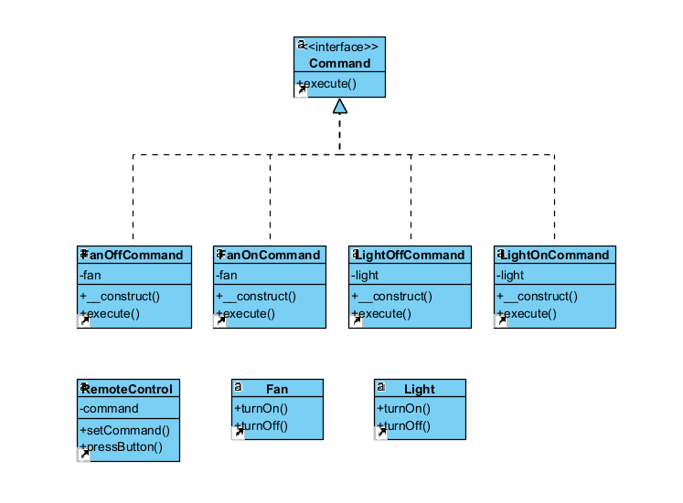

# Design pattern de manière globale :
L'objectif est d'encapsuler une demande en tant qu'objet, permettant ainsi de paramétrer des objets avec différentes demandes, de les mettre dans une file d'attente, de les annuler ou de les manipuler de manière flexible

# Avantages :
- La file d'attente d'opérations est facile à implémenter, car chaque opération est encapsulée en tant qu'objet
- Mettre en place une fonctionnalité annuler-rétablir
- Différer l’exécution des traitements
- Assembler plusieurs commandes simples en une seule plus complexe

# Inconvénients : 
- Le code peut devenir plus compliqué, car vous créez une nouvelle couche entre les demandeurs et les récepteurs
  
# Représentation UML : 


# Implémentation en PHP :
``` php
<?php

// Interface commune pour toutes les commandes
interface Command
{
    public function execute();
}

// Commande concrète pour allumer une lumière
class LightOnCommand implements Command
{
    private $light;

    public function __construct(Light $light)
    {
        $this->light = $light;
    }

    public function execute()
    {
        $this->light->turnOn();
    }
}

// Commande concrète pour éteindre une lumière
class LightOffCommand implements Command
{
    private $light;

    public function __construct(Light $light)
    {
        $this->light = $light;
    }

    public function execute()
    {
        $this->light->turnOff();
    }
}

// Commande concrète pour allumer un ventilateur
class FanOnCommand implements Command
{
    private $fan;

    public function __construct(Fan $fan)
    {
        $this->fan = $fan;
    }

    public function execute()
    {
        $this->fan->turnOn();
    }
}

// Commande concrète pour éteindre un ventilateur
class FanOffCommand implements Command
{
    private $fan;

    public function __construct(Fan $fan)
    {
        $this->fan = $fan;
    }

    public function execute()
    {
        $this->fan->turnOff();
    }
}

class Light
{
    public function turnOn()
    {
        echo "La lumière est allumée.\n";
    }

    public function turnOff()
    {
        echo "La lumière est éteinte.\n";
    }
}

class Fan
{
    public function turnOn()
    {
        echo "Le ventilateur est allumé.\n";
    }

    public function turnOff()
    {
        echo "Le ventilateur est éteint.\n";
    }
}

class RemoteControl
{
    private $command;

    public function setCommand(Command $command)
    {
        $this->command = $command;
    }

    public function pressButton()
    {
        $this->command->execute();
    }
}

// Exemple d'utilisation
$light = new Light();
$fan = new Fan();

$lightOnCommand = new LightOnCommand($light);
$lightOffCommand = new LightOffCommand($light);

$fanOnCommand = new FanOnCommand($fan);
$fanOffCommand = new FanOffCommand($fan);

$remote = new RemoteControl();

// Utilisation de la télécommande pour allumer la lumière
$remote->setCommand($lightOnCommand);
$remote->pressButton();

// Utilisation de la télécommande pour éteindre la lumière
$remote->setCommand($lightOffCommand);
$remote->pressButton();

// Utilisation de la télécommande pour allumer le ventilateur
$remote->setCommand($fanOnCommand);
$remote->pressButton();

// Utilisation de la télécommande pour éteindre le ventilateur
$remote->setCommand($fanOffCommand);
$remote->pressButton();
```

