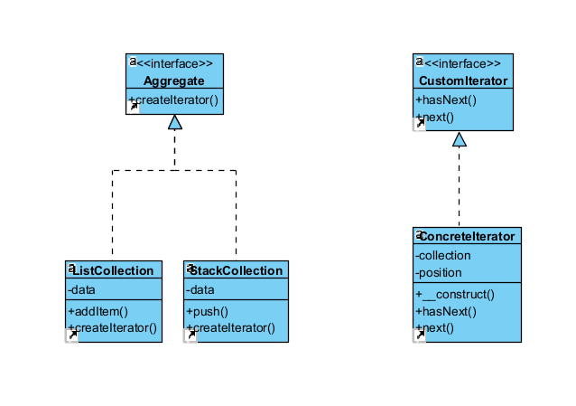

# Design pattern de manière globale :
L'objectif est de résout élégamment le problème du parcours des collections en encapsulant l'algorithme de parcours dans des objets itérateurs

# Avantages :
- Nettoyer le code client et les collections en déplaçant les algorithmes de parcours — souvent très lourds — dans des classes séparées
- Implémenter de nouveaux types de collections et d’itérateurs et les utiliser avec le code existant sans rien endommager
- Parcourir une même collection avec plusieurs itérateurs simultanément, car chacun possède son propre état d’itération
- Arrêter une itération et la reprendre quand vous le souhaitez

# Inconvénients : 
- L’utilisation de ce patron est exagérée si votre application ne se sert que de collections simples
- Les itérateurs sont parfois moins efficaces que certaines collections spécialisées
  
# Représentation UML : 


# Implémentation en PHP :
``` php
<?php

// Custom Iterator interface
interface CustomIterator
{
    public function hasNext(): bool;
    public function next();
}

// Aggregate interface
interface Aggregate
{
    public function createIterator(): CustomIterator;
}

// Concrete Iterator class
class ConcreteIterator implements CustomIterator
{
    private $collection;
    private $position = 0;

    public function __construct(array $collection)
    {
        $this->collection = $collection;
    }

    public function hasNext(): bool
    {
        return $this->position < count($this->collection);
    }

    public function next()
    {
        $item = $this->collection[$this->position];
        $this->position++;
        return $item;
    }
}

// Concrete List class
class ListCollection implements Aggregate
{
    private $data = [];

    public function addItem($item)
    {
        $this->data[] = $item;
    }

    public function createIterator(): CustomIterator
    {
        return new ConcreteIterator($this->data);
    }
}

// Concrete Stack class
class StackCollection implements Aggregate
{
    private $data = [];

    public function push($item)
    {
        array_push($this->data, $item);
    }

    public function createIterator(): CustomIterator
    {
        return new ConcreteIterator($this->data);
    }
}

// Example usage
$list = new ListCollection();
$list->addItem("Item 1");
$list->addItem("Item 2");
$list->addItem("Item 3");

$stack = new StackCollection();
$stack->push("Item A");
$stack->push("Item B");
$stack->push("Item C");

// Using iterator with list
$listIterator = $list->createIterator();
echo "Liste:\n";
while ($listIterator->hasNext()) {
    echo $listIterator->next() . "\n";
}

// Using iterator with stack
$stackIterator = $stack->createIterator();
echo "\nPile:\n";
while ($stackIterator->hasNext()) {
    echo $stackIterator->next() . "\n";
}
```
