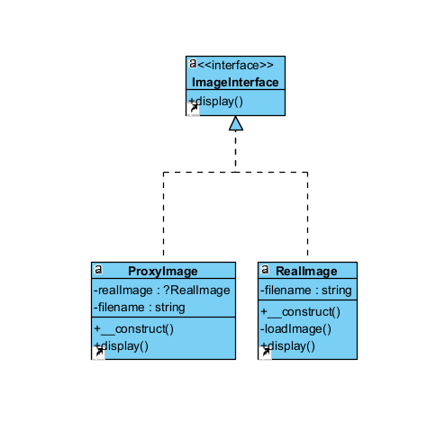

# Design pattern de manière globale :
L'objectif est de supporter un objet pour en contrôler l'accès

# Avantages :
- Restriction des opérations non autorisées
- Report de la création et de l'initialisation d'objets coûteux jusqu'à ce qu'ils soient nécessaires
- Conserver la trace des opérations effectuées sur un objet

# Inconvénients : 
- Augmentation du temps de réponse du service
- Code qui devient compliqué
  
# Représentation UML : 


# Implémentation en PHP :
``` php
<?php

interface ImageInterface {
    public function display(): void;
}

class RealImage implements ImageInterface {
    private string $filename;

    public function __construct(string $filename) {
        $this->filename = $filename;
        $this->loadImage();
    }

    private function loadImage(): void {
        echo "Chargement de l'image: $this->filename\n";
    }

    public function display(): void {
        echo "Affichage de l'image: $this->filename\n";
    }
}

class ProxyImage implements ImageInterface {
    private ?RealImage $realImage = null;
    private string $filename;

    public function __construct(string $filename) {
        $this->filename = $filename;
    }

    public function display(): void {
        if ($this->realImage === null) {
            $this->realImage = new RealImage($this->filename);
        }
        $this->realImage->display();
    }
}

$productImage = new ProxyImage("image_haute_resolution.jpg");

$productImage->display();
```

# Rendu du code
```
Chargement de l'image: image_haute_resolution.jpg
Affichage de l'image: image_haute_resolution.jpg
```
